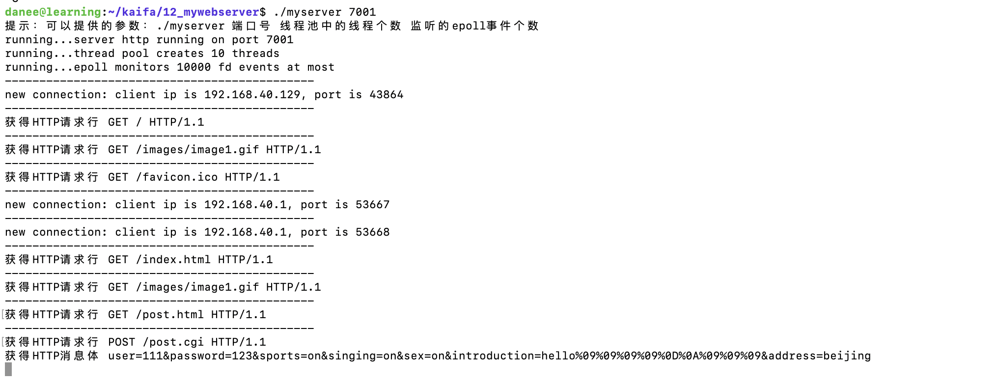

## my_webserver

### 1、运行

~~~c
make
./myserver
~~~

### 2、整体流程图

1、默认端口号是7000，也可以修改服务器端口号

```
./myserver 7001
```

2、运行成功后默认显示的为 test.html 界面，就可以看到一个动态的墩子啦（如果不成功得多刷新几次）～同时同一路径下还有 post.html 界面




### 3、整体框架图


### 4、压力测试

```
cd test_pressure/webbench-1.5/
make
./webbench -c 2000 -t 5 http://192.168.40.129:7001/index.html
参数：
	-c 表示客户端数
	-t 表示时间，单位：秒
```


### 5、参考资料

https://www.nowcoder.com/study/live/504/5/1

https://github.com/forthespada/MyPoorWebServer

https://www.cnblogs.com/qiyeboy/p/6296387.html

https://www.jianshu.com/p/18cfd6019296